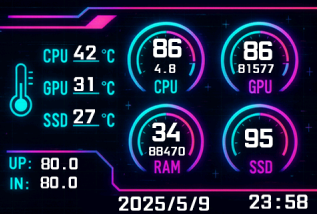
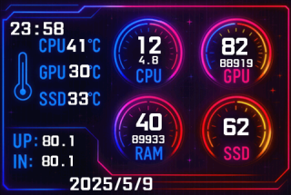
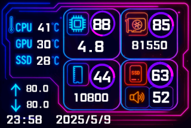

# Turing-Smart-Screen-3.5-Inch-IPS Themes

## Available Themes

### 1. Aurora  

### 2. Neon Grid  

### 3. Neon Material  

## Installation

Copy the `.data` files into the application's `config` folder (same folder where the `.exe` is located, inside `/config`).

Restart the application to load the new themes.

---
© 2025 SunixDev

Licensed under the Creative Commons Attribution 4.0 International License.  
See [LICENSE](LICENSE) for details.